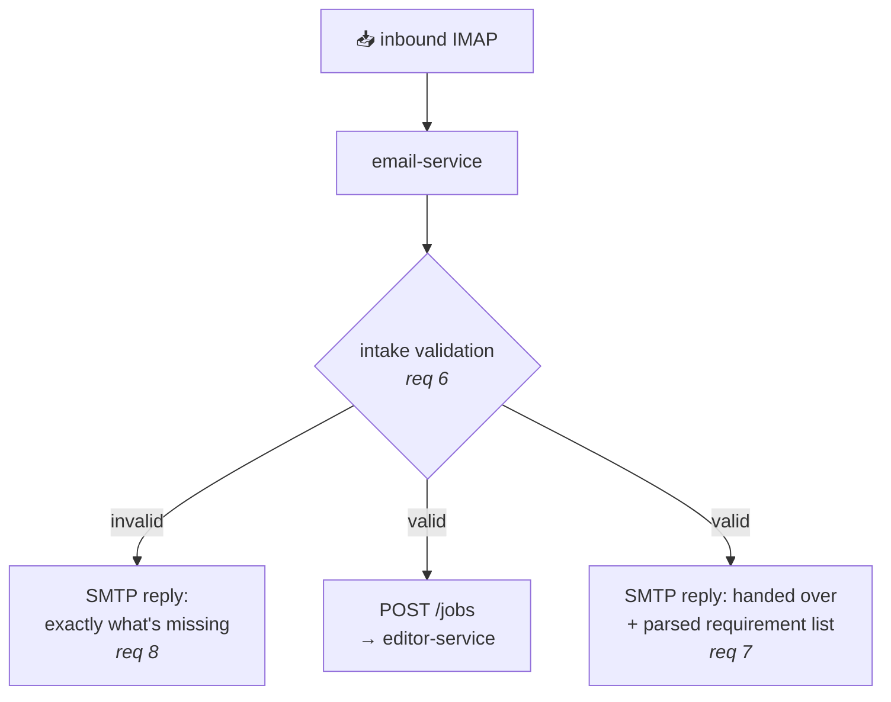
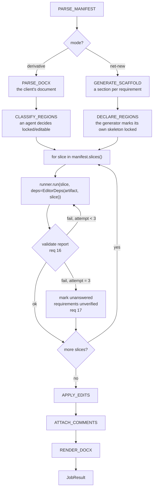

# Email Form Validation — AI Editor + Email Service

## Context

`multimodal-form-filling/email-form-validation-requirements.pdf` (17 numbered requirements + 3 open concerns) specifies an email-driven form validation app. Our scope is **Part 1 (email server layer)** and **Part 2 (AI editor)** — GCP deployment is someone else's, but every service we ship must be containerised so they can take it.

The repo is currently empty (README + PDF only). This plan lays down a scaffold plus a set of **branch-sized tasks that Sonnet subagents can execute in parallel and raise PRs from**.

Decisions locked with the user:

| Question | Decision |
|---|---|
| Email transport | IMAP poll (inbound) + SMTP send (outbound) |
| Locked/editable regions | Agent-derived on the first run, stored in artifact state |
| Service boundary | Two services over HTTP, frozen contracts package between them |
| Word comments | `python-docx` native comments (`document.add_comment`) |

Not in scope for v1: image tooling (req 13) ships as a **stubbed interface only** — the real cropping/understanding module comes later; OCR/PDF input (D1); job status polling (D2); cross-requirement conflict detection (D3).

## Framework grounding (verified against current docs)

- **Programmatic hand-off** (req 11) is a Pydantic AI documented pattern: agents called in succession from *plain Python*, each run scoped to its own requirement slice, context carried by `message_history=` and shared `deps`/`usage`. There is no graph DSL needed — the "state machine" is our own explicit loop.
- **Shared state** (req 12) = a `deps` dataclass holding the `Artifact` python object. Tools mutate it in place; it outlives every run.
- **Gemini**: `GoogleModel(<model-id>, provider=GoogleProvider(api_key=...))`, plus `HttpRetryOptions` for transport-level retry and `UsageLimits` per slice.
- **Validation/retry** (reqs 16–17): `@agent.output_validator` raising `ModelRetry` handles cheap in-run structural fixes; the **3-attempt cap and the mark-unverified terminal state live in our outer loop**, because req 17 requires a durable terminal outcome, not an exception.
- **Evals**: `pydantic-evals` ships with Pydantic AI — `Case`/`Dataset`/`Evaluator`, plus built-in `LLMJudge`, `IsInstance`, `Contains` and **`MaxDuration(seconds=...)`**. `EvaluatorContext` exposes `ctx.duration`, `ctx.metrics` and `ctx.span_tree`, so correctness, latency and token cost all come out of a single run. Agents are `pydantic-ai`; evals are `pydantic-evals`.
- **Comments**: `document.add_comment(runs=..., text=..., author=..., initials=...)` and `document.comments` are supported in `python-docx` ≥ 1.2.

## Architecture

### Email layer (`email-service`)



### Editor layer (`editor-service`, `POST /jobs`)



### Are the two modes actually different?

Mostly no — and it is worth being precise about the part that is, because it drives
where the code splits.

**They diverge in exactly one place: how the artifact is seeded.** Derivative parses
the client's `.docx`. Net-new has no document, so **it has to generate one** — a
scaffold with a section per requirement, built from `Requirement[]` plus the client's
inputs. Everything downstream of that — the slice loop, validation, the retry cap,
edit application, comments, rendering — is shared, byte for byte.

**Both modes have regions.** They differ only in who decides them. In derivative an
agent classifies the client's existing content. In net-new the generator declares them
as it emits the scaffold: headings and field labels come out locked, the content slots
come out editable. Same mechanism, different author.

**So why keep two runners at all?** Not for structural reasons — for *authority*.
A derivative run **may not write**; a net-new run **must**. That is the whole product
distinction: a client sending a form for validation wants to be told it is wrong, not
to receive a silently corrected version. Locked regions are the enforcement, and
keeping the runners separate is what stops the derivative agent from drifting into
"helpfully" editing the document until every requirement passes.

Formally you *could* collapse net-new into "derivative over an empty document where
everything is editable and every requirement starts failing" — `realised` is then just
`pass, authored by us`. It is elegant and it is a trap: it puts writing on the common
path, and the pressure from there is all in the wrong direction.

**Consequence for the plan:** the scaffold generator is a real component, not the
hand-wave "blank/template doc" this plan carried earlier. It is the one genuinely new
thing net-new needs, and it belongs to B7.

## State & persistence

Req 12 says the artifact lives "outside any single agent run". In-process that's a Python object — but across an HTTP boundary, a retry, a crash, or a second replica, an in-process object is gone. It needs a store, and that store is also what finally gives **D2** (job status after confirmation) something to report.

**Yes — a Firestore-backed store with async `save`/`load`. But it goes behind an interface, not into the flows.**

```python
# ffx-contracts — frozen alongside the models
class ArtifactRepository(Protocol):
    async def save(self, artifact: Artifact, *, expected_version: int) -> int: ...
    async def load(self, job_id: str) -> tuple[Artifact, int]: ...

class JobRepository(Protocol):
    async def put(self, record: JobRecord) -> None: ...
    async def get(self, job_id: str) -> JobRecord | None: ...
```

Two implementations: `InMemoryRepository` (tests, evals, local dev) and `FirestoreRepository` (GCP, via `google.cloud.firestore.AsyncClient`, which is natively async). The state machine only ever sees the Protocol.

That indirection is not ceremony — it is what lets **CI and the whole Tier-A eval suite run with no GCP credentials and no emulator**. Provisioning Firestore is the deployment owner's job; the client code is ours.

### Four things a naive `save`/`load` gets wrong

**1 · Firestore's 1 MiB document cap.** An `Artifact` carrying every `Line` of a 50-page form plus a comment per requirement can approach it, and the `.docx` bytes blow straight past it. So: **Firestore holds the JSON state, GCS holds the documents**, referenced by path. Getting this wrong surfaces as a hard write failure on exactly the large documents the product exists to handle.

**2 · The job record is not the artifact.** `JobRecord` — status, mode, current slice, attempts used, unverified ids, timestamps — is a separate small document that is cheap to poll. That is the D2 answer, and it stays readable even when the artifact is mid-write.

**3 · Optimistic concurrency.** The artifact is mutated across many slice runs. Carry a `version` int and check it on write. v1 runs slices sequentially so it should never fire — but if it ever does, a lost update means silently dropped review comments, which is the worst possible failure here because the output still looks complete.

**4 · Checkpoint per slice, not per job.** Save after each slice completes. That makes a crashed job resumable rather than restartable, and gives the job record real progress to report instead of a binary running/done.

### The blob pointer

Firestore stores the run's *shape*; the bucket stores its *weight*. One reference type covers both directions:

```python
class BlobRef(BaseModel):
    uri: str            # gs://<bucket>/jobs/<job_id>/<kind>/<sha256>
    content_type: str
    size_bytes: int
    sha256: str
```

It carries the client's source `.docx`, the rendered output, and **every image extracted from a form**. Content-addressing by `sha256` means a retried job re-points at the existing object instead of writing a second copy — which matters, because req 17 retries up to three times and a naive path scheme would triple-write on every recovery.

This is also the seam the deferred image module (**B11**) picks up: it reads `BlobRef`s already sitting on the artifact and returns crops as new ones. No schema change when it lands — which is the whole reason for stubbing the interface now rather than leaving a hole.

## Layout

```
pyproject.toml
packages/
  ffx-contracts/
  ffx-docmodel/
  ffx-manifest/
services/
  email-service/
  editor-service/
fixtures/fleet-vehicle-return/
docker/
```

| Path | Purpose |
|---|---|
| `pyproject.toml` | uv workspace, ruff + pytest + mypy |
| `packages/ffx-contracts` | **FROZEN** shared models — the seam that makes parallelism safe |
| `packages/ffx-docmodel` | docx ⇄ line-addressable `Artifact`, regions, comment writer |
| `packages/ffx-manifest` | free-text manifest → discrete `Requirement[]` |
| `services/email-service` | FastAPI + IMAP poller + SMTP sender |
| `services/editor-service` | FastAPI + state machine + Pydantic AI agents (Gemini) |
| `fixtures/fleet-vehicle-return` | the illustrative example, as golden test data |
| `docker/` | one Dockerfile per service + compose for local dev |

## The contract to freeze first (`ffx-contracts`)

Everything else is written against these. **No branch may edit this package** — a change request goes back through the layer-0 owner.

```python
class Requirement(BaseModel):
    id: str                    # "R-03"
    text: str                  # one normalised, individually checkable statement (req 5)
    source_span: str           # verbatim manifest text it was derived from
    scope: str                 # slice key — which agent run owns it (req 11)
    applies_to: list[str]      # form ids; empty = all forms

class Manifest(BaseModel):
    raw: str
    requirements: list[Requirement]
    def slices(self) -> dict[str, list[Requirement]]: ...

class Line(BaseModel):         # the addressable unit edits target (req 14)
    id: str                    # stable: "p12", "t3.r2.c1.p0"
    text: str

class Region(BaseModel):
    id: str
    line_ids: list[str]
    locked: bool
    rationale: str             # why the first run classified it this way

class Edit(BaseModel):
    line_id: str; new_text: str; requirement_id: str

class ReviewComment(BaseModel):
    line_id: str
    requirement_id: str
    verdict: Literal["pass", "fail", "realised", "unverified"]
    justification: str                 # req 16: every answer justified
    suggestion: str | None             # required when verdict == "fail" (req 10)
    source_reference: str              # req 16: must resolve to a real Requirement or Line

class Artifact(BaseModel):     # req 12 — lives outside any single agent run
    doc_id: str
    lines: list[Line]
    regions: list[Region]
    edits: list[Edit]
    comments: list[ReviewComment]

class Mode(StrEnum): DERIVATIVE = "derivative"; NET_NEW = "net_new"
class JobRequest(BaseModel):   # email-service → editor-service
    job_id: str; mode: Mode; manifest_raw: str
    forms: list[FormPayload]; client_inputs: dict[str, Any]
class JobResult(BaseModel):
    job_id: str; status: Literal["done", "failed"]
    documents: list[DocumentPayload]; unverified: list[str]

class IntakeProblem(BaseModel): code: str; detail: str     # req 8: what to add/change
class IntakeVerdict(BaseModel): valid: bool; problems: list[IntakeProblem]
```

## Parallel branch tasks

Directory ownership is **disjoint per branch** — that is what keeps 7 concurrent PRs from conflicting.

### Layer 0 — blocking, one PR, must merge before anything else

**B0 · scaffold + contracts** — `pyproject.toml`, `packages/ffx-contracts/**`, `Makefile`, CI workflow (ruff + mypy + pytest), empty package/service skeletons so later branches only add files. Ships the frozen models above with full unit tests on the validators (`suggestion` required when `verdict=="fail"`, etc.).

### Layer 1 — 8 PRs in parallel, all branch from B0

| ID | Branch | Owns | Deliverable |
|----|--------|------|-------------|
| **B1** | `feat/docmodel` | `packages/ffx-docmodel/**` | `.docx → Artifact` (stable line ids incl. table cells), `apply_edits()` surgical line replace with **locked-region enforcement** (raises on a locked target), `attach_comments()` via `python-docx` `add_comment`, `Artifact → .docx`. No AI. Round-trip tests on fixture docs. |
| **B2** | `feat/manifest` | `packages/ffx-manifest/**` | Free text → `Requirement[]` (req 5): deterministic pre-split + one small Gemini extraction agent, stable ids, `source_span` provenance, `slices()` grouping strategy. Tested with `FunctionModel` — no live API in CI. |
| **B3** | `feat/intake` | `services/email-service/src/**/{intake,replies}.py` | Req 6/7/8: MIME parse, attachment extraction, mode inference (derivative needs supplied forms — req 3), `IntakeVerdict` rules, and both reply templates — the valid one **embeds the parsed requirement list** (req 7 *Recommended*). |
| **B4** | `feat/mail-transport` | `services/email-service/src/**/transport/**` | `MailTransport` Protocol + IMAP poller (IDLE/poll, seen-state, idempotency by Message-ID) + SMTP sender with threaded replies (`In-Reply-To`/`References`), **plus an in-memory fake** every other branch tests against. |
| **B5** | `feat/editor-machine` | `services/editor-service/src/**/{machine,slicing,validation}.py` | The state machine + programmatic hand-off loop: slice iteration, `EditorDeps`, the `SliceReport` validator (every requirement answered / justified / reference resolves — req 16), 3-attempt cap with the error fed back, then `unverified` (req 17). Agent-agnostic: takes a `SliceRunner` Protocol so B6/B7 plug in. Tested with `TestModel`. |
| **B8** | `feat/llm-config` | `services/editor-service/src/**/llm/**`, `settings.py` | `GoogleModel` + `GoogleProvider` wiring, pinned model id in settings, `HttpRetryOptions`, per-slice `UsageLimits`, shared `RunUsage` accounting, structured logging. One `build_agent()` factory both flows call. |
| **B10** | `feat/docker` | `docker/**`, `compose.yaml` | Multi-stage Dockerfile per service (non-root, uv-installed deps, healthcheck), compose bringing up both services + `mailpit` for a local mailbox. No GCP, no Terraform. |

| **B12** | `feat/state-store` | `packages/ffx-store/**` | `ArtifactRepository` + `JobRepository`: the in-memory adapter every other branch tests against, and the Firestore + GCS adapter for GCP. Versioned writes, per-slice checkpointing, no credentials needed for the in-memory path. |

### Layer 2 — 3 PRs in parallel, need B1/B5 (+B8)

| ID | Branch | Owns | Deliverable |
|----|--------|------|-------------|
| **B6** | `feat/flow-derivative` | `services/editor-service/src/**/flows/derivative.py`, `agents/derivative/**` | The `CLASSIFY_REGIONS` first run (locked vs editable + rationale, per the locked decision) and the per-slice validation agent: reads the artifact, emits **one comment per requirement per form** with pass/fail + justification + suggestion (req 10). Refuses edits into locked regions. |
| **B7** | `feat/flow-netnew` | `services/editor-service/src/**/flows/netnew.py`, `agents/netnew/**` | **The scaffold generator** (`Requirement[]` + client inputs → a document skeleton, declaring its own locked/editable regions as it emits) plus the authoring runner. Comments show **how each requirement was realised**, with justification + source reference (req 10). |
| **B11** | `feat/vision-stub` | `services/editor-service/src/**/tools/vision/**` | Req 13 placeholder only: `VisionTool` Protocol (`crop`, `describe`) + toolset registration behind a `FEATURE_VISION` flag defaulting off, raising `NotImplementedError`. Exists so the real image module lands later without touching B6/B7. |

### Layer 3 — after Layer 2

**B9 · fleet-vehicle-return example + e2e** — `fixtures/fleet-vehicle-return/**` (manifest free-text, a supplied Word form for derivative, client inputs for net-new, golden expected comments) and an end-to-end test that drives a real email through the fake transport into both modes. This is the demo.

## Evals & latency budgets

**Every branch ships an eval suite. A PR without one does not merge.** "It works" is not a claim any subagent gets to make on its own recognisance — each stage must produce a number.

We use **`pydantic-evals`** (ships with Pydantic AI, same ecosystem): `Case` / `Dataset` / `Evaluator`, the built-in `IsInstance`, `Contains`, `LLMJudge`, and — directly answering the latency requirement — **`MaxDuration(seconds=...)`** as a first-class assertion. `EvaluatorContext` exposes `ctx.duration`, `ctx.metrics` and `ctx.span_tree`, so correctness, latency and token cost come out of one run.

### Two tiers

**Tier A — deterministic components** (no model anywhere): docmodel, intake rules, transport, contracts, the store. Golden assertions plus a wall-clock budget. Runs in CI on every push.

**Tier B — pipeline evals**: the system under test calls a live model, so it costs money and runs nightly or on demand rather than on every push. CI substitutes `TestModel`.

**The scorer is structural in both tiers.** No LLM-as-judge anywhere. The pipeline is non-deterministic; whether its output is complete is not:

> non-deterministic system + deterministic scorer = a repeatable number

A judge would be the wrong instrument here anyway. The question is not "is this justification well written" but "does every requirement have a verdict, does every failure carry a suggestion, does every reference resolve, and are the verdicts *right*" — all decidable by reading the document. Scoring is a **violation count against a spec**, threshold zero, not a similarity or a rubric score.

Deliberately **not** a text-similarity comparison against the golden output document either: that fails on harmless wording differences in a justification while happily passing a document with the wrong verdicts. The golden `.docx` is a reference for humans to eyeball; the spec file is what the evaluator asserts.

### Invariants vs. scores — the important distinction

Some things are **contract violations, not quality signals**, and are asserted at `1.0` with no tolerance:

- every requirement in the slice has an answer (req 16)
- every answer has a non-empty justification (req 16)
- every `source_reference` resolves to a real `Requirement` or `Line` (req 16)
- every `verdict == "fail"` carries a non-empty `suggestion` (req 10)
- no edit ever lands in a locked region

Everything else is scored with a threshold. Mixing the two is how eval suites end up green while the product is broken.

### Budgets and thresholds

| # | Stage | Owner | p95 latency | Quality gate |
|---|---|---|---|---|
| A1 | `docx → Artifact → docx` round-trip (50pp) | B1 | **800 ms** | byte-stable on no-op; line ids stable across reload |
| A2 | `apply_edits` + `attach_comments` (100 comments) | B1 | **1.5 s** | opens clean in Word; comment count exact |
| A3 | MIME parse → `IntakeVerdict` | B3 | **200 ms** | 100% on the intake rule matrix (req 6/8) |
| A4 | SMTP send (incl. attachments) | B4 | **3 s** | threading headers correct; idempotent on retry |
| A5 | IMAP arrival → confirmation reply sent | B3+B4 | **30 s** | poll interval dominates; no double-send on redelivery |
| L1 | manifest → `Requirement[]` | B2 | **8 s** | recall ≥ 0.95, **precision 1.0** (zero invented reqs), every `source_span` verbatim in raw |
| L2 | `CLASSIFY_REGIONS` (1 form) | B6 | **15 s** | accuracy ≥ 0.90, **zero false-editable** on client-identity regions |
| L3 | one slice run (5 reqs) | B5+B6 | **20 s** | invariants 1.0; verdict set matches golden exactly |
| L4 | net-new slice run | B7 | **20 s** | structural spec violations = 0; reference-resolution 1.0 |
| A6 | artifact `save` → `load` round-trip | B12 | **300 ms** | version conflict detected; GCS blob pointer resolves |
| E1 | full derivative job (10 reqs, 1 form) | B9 | **90 s** | end-to-end on the fleet fixture |
| E2 | full net-new job (10 reqs) | B9 | **120 s** | end-to-end on the fleet fixture |

Treat these as **calibration targets, not measurements** — B0 lands the harness, and the first branch to run each stage records the real baseline in its PR. If a budget turns out to be wrong, the PR moves the number and says why; what's not allowed is shipping without one.

Note the asymmetry in **L2**: a region wrongly marked *editable* means we overwrite the client's own content, which is far worse than a region wrongly marked *locked* (we merely decline to help). The eval weights those errors differently on purpose.

### What a branch's eval dir looks like

```
packages/ffx-manifest/evals/
  cases.yaml          the dataset — inputs + expected, reviewable in a PR diff
  structure.yaml      the structural spec this stage's output must satisfy
  evaluators.py       custom Evaluator subclasses; assert the spec, never judge
  test_evals.py       Tier A: runs under pytest in CI with TestModel
  README.md           recorded baseline: violations, p95, tokens, model id, date
```

**Mutation-test the evaluator.** An evaluator that has only ever seen correct output is worthless — it may be asserting nothing. Each branch must break its own golden output in at least three ways and show the evaluator catching each. This is not optional: the fixture's reference checker had a real bug (a field extractor that swallowed the rest of the comment, so a one-character justification passed a length check) and only mutation testing found it.

## Code quality bar

Seven agents writing in parallel is exactly how a codebase turns to mud. The defence is machine-enforced, not review-enforced — a human reviewer will not reliably catch architectural drift across 12 concurrent PRs.

**Enforced in CI (B0 ships the config; every branch must pass):**

- **ruff** lint + format, one shared config, zero per-package overrides.
- **mypy `--strict`** across the workspace. A `# type: ignore` needs a specific error code and a comment saying why.
- **import-linter** contracts pinning the dependency direction: `services → packages → ffx-contracts`, never sideways, never upward. This is the single most valuable gate here — it's what stops B6 from reaching into B4's internals at 2am.
- **`ffx-contracts` has no third-party dependency but `pydantic`.** It's the seam; it stays boring.
- **Per-package coverage ≥ 85%**, measured per package, not globally — a global number lets one well-tested package hide four untested ones.
- **No model call outside `llm/` and `agents/`.** Enforced by import-linter.

**Conventions (in the PR template, checked by review):**

- Prompts live in versioned files under `agents/<name>/prompts/`, never inline f-strings. They're the highest-churn, highest-impact artefact in the repo and they need a diff history.
- Each package declares its public API in `__init__.py` via `__all__`; everything else is private and may change without notice.
- Structured logging only (`structlog`), with `job_id` and `slice` bound on every line. Print statements fail lint.
- Any decision worth arguing about gets an ADR in `docs/adr/NNN-title.md`. Cheap to write, and it stops the same debate recurring in three PRs.
- Domain language matches the spec: `Requirement`, `Artifact`, `Line`, `Region`, `slice`, `verdict`. No synonyms.

## Spec template for each subagent PR

Each Sonnet agent gets a brief containing, verbatim:

1. **Requirement ids from the PDF it must satisfy** (e.g. B1 → reqs 14, 15; B5 → reqs 11, 12, 16, 17).
2. **The exact directories it owns** and the instruction that touching anything else — especially `ffx-contracts` — is out of bounds; raise it in the PR description instead.
3. **The frozen contract signatures** it consumes and produces.
4. **Test requirements**: unit tests in its own package; no live Gemini calls in CI (`TestModel`/`FunctionModel` only); `make check` green.
5. **Eval requirements**: the `evals/` dir for its stage, the invariant assertions at 1.0, and the **recorded baseline** (score, p95 latency, tokens, model id, date) pasted into the PR description. A branch that cannot state its numbers is not done.
6. **PR discipline**: branch from `main` after B0, one PR, description lists requirement ids covered and any contract change it wants.

## Verification

- `make check` — ruff, mypy, pytest across the workspace; no network.
- `packages/ffx-docmodel`: round-trip a fixture docx, assert line ids stable, assert a locked-region edit raises, open the output in Word and confirm comments land in the review pane.
- `services/editor-service`: `TestModel`-driven machine tests — force a validator failure three times and assert the requirement comes back `unverified` rather than raising.
- `services/editor-service`: one **live** Gemini smoke test behind an env flag, run manually, not in CI.
- End-to-end (B9): `docker compose up`, drop the fleet-vehicle-return email into mailpit, assert (a) confirmation reply contains the parsed requirement list, (b) the returned .docx has one comment per requirement, (c) net-new mode produces a document from client inputs alone.

## Open, carried forward

D1 (PDF/OCR input), D2 (job status after confirmation — the HTTP boundary leaves room for a `GET /jobs/{id}`), D3 (cross-requirement conflicts, invisible to per-slice runs). None blocks v1.
