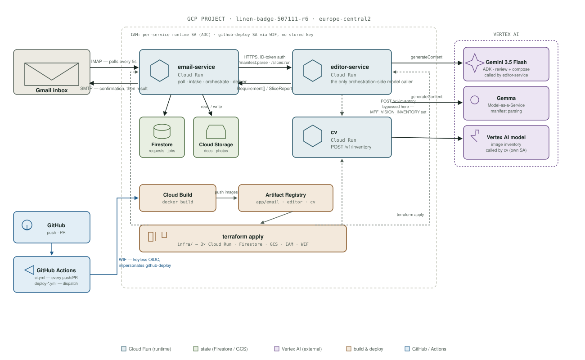

# Amendo — deployed architecture

One GCP project (`linen-badge-507111-r6`), one region (`europe-central2`),
three Cloud Run services, three model-calling surfaces, and infrastructure
defined entirely in Terraform.

## Three model calls, two services

Two services call Vertex AI, and no other code in the repo does — each with
its own runtime service account:

- **`editor-service`**, twice, for two different jobs:
  - **Manifest parsing** (`PARSER_MODEL_ID`) runs on **Gemma** —
    `gemma-4-26b-a4b-it-maas`, served through Vertex AI's
    **Model-as-a-Service** endpoint. It turns the client's free-text
    requirements into a structured `Requirement[]`, with every extracted
    item's source span verified verbatim against the manifest.
  - **Review and composition** (`EDITOR_MODEL_ID`) runs on **Gemini 3.5
    Flash**, driven through a **Google ADK** agent. This is what reads the
    submitted photos and either reviews an existing form (derivative) or
    drafts a new one (net-new).
- **`cv`** — a separately-owned Cloud Run service (`services/cv`), called by
  `editor-service` at `POST /v1/inventory` (`gs://` image URIs in, a
  requirement-by-requirement inventory out). Internally it calls its own
  Vertex AI model (`CV_MODEL`) directly against `generateContent`, under its
  own service account — `editor-service` never touches Vertex AI on `cv`'s
  behalf, and per the repo's own rule ("the vision service is owned
  separately, and may use Pydantic AI") it isn't required to go through ADK
  the way `editor-service` does.

Both of `editor-service`'s own models are called at
`GOOGLE_CLOUD_LOCATION=global` — the regional endpoint 404s for both,
verified live, which is why that's pinned rather than left as
`us-central1`.

**In this deployment, the third call never actually fires.**
`editor-service` has both `CV_URL` (pointing at the real, live `cv` Cloud Run
URL) and `MFF_VISION_INVENTORY` set; `get_vision_tool()` checks
`MFF_VISION_INVENTORY` first, so every request in this demo resolves photo
evidence against a fixture inventory baked into the editor image instead of
calling `cv` at all. `cv` itself is fully deployed and reachable — the wiring
is real, just short-circuited for a fixture whose 15 images are already
hand-labelled.

## Runtime, request by request

`email-service` polls the mailbox over IMAP every 5 seconds, confirms over
SMTP immediately, writes `RequestRecord`/`JobRecord`s to **Firestore**, and
calls `editor-service` over HTTPS with a Google-issued ID token (no API
key) — `POST /manifest:parse`, then `POST /slices:run` per batch of up to 6
requirements. `editor-service` is the only component the orchestrator calls
out to for a model decision; document compilation (`python-docx`), Word
comments, and photo embedding all happen back on `email-service`'s side,
reading blobs from **Cloud Storage**.

## Infrastructure is Terraform, not console clicks

`infra/`, GCS backend at `gs://linen-badge-507111-r6-tfstate/infra/`:

| File | Owns |
|---|---|
| `apis.tf` | enables the required GCP APIs |
| `firestore.tf`, `storage.tf` | the `(default)` Firestore database and the files bucket |
| `artifact_registry.tf` | the `app` repo holding `email`, `editor`, `cv` images |
| `run_email.tf`, `run_editor.tf`, `run_cv.tf` | the three Cloud Run services (created once their `*_image` variable is set) |
| `iam.tf`, `wif.tf` | runtime service accounts (Cloud Run uses ADC, no keys) and Workload Identity Federation, so GitHub Actions authenticates by OIDC token exchange, not a stored service-account key |

## CI/CD is GitHub Actions, in two tiers

- **`ci.yml`** — every push and PR: `ruff format`/`check`, `mypy --strict`,
  `import-linter`, the full `pytest` suite, the fixture's 156-check
  structural evaluator, and `terraform fmt -check` / `terraform validate`.
  Entirely offline — no secrets, no live model calls, no GCP credential in
  this job at all.
- **`deploy-{email,editor,cv}.yml`** — one workflow per service,
  `workload_identity_provider`-authenticated, each: `gcloud builds submit` →
  tag `app/<service>:<git sha>` → `terraform apply -var=<service>_image=…`.
  Editor and CV deploy on push to `main`; **email is deliberately
  `workflow_dispatch`-only** — a push-triggered apply without the mailbox
  variables present would wipe the poller or destroy the service, so that
  one is a manual button, not automatic.

## Honest gaps

- SMTP/IMAP credentials reach Cloud Run as plain Terraform variables from a
  gitignored `terraform.tfvars`, not Secret Manager yet.
- Everything deployed during live demo hardening went through the manual
  "laptop path" (`gcloud builds submit` + `gcloud run services update`
  directly) for iteration speed, not the canonical `deploy-*.yml` route — so
  the currently running *images* aren't yet reflected back into Terraform
  state or a merged PR. That reconciliation is real follow-up work, not
  done.
- One live-vs-Terraform drift *is* reconciled: two addresses added straight
  to Cloud Run's `ALLOWED_SENDERS` (for hackathon judge/testing accounts)
  were not in any tracked source — a real `terraform apply` would have
  reverted the live allowlist to `variables.tf`'s empty default, which means
  *closed*, not open (`allowed_senders_from_env`), locking out every sender.
  `infra/terraform.tfvars` (gitignored, not committed) now carries the real
  current value.
